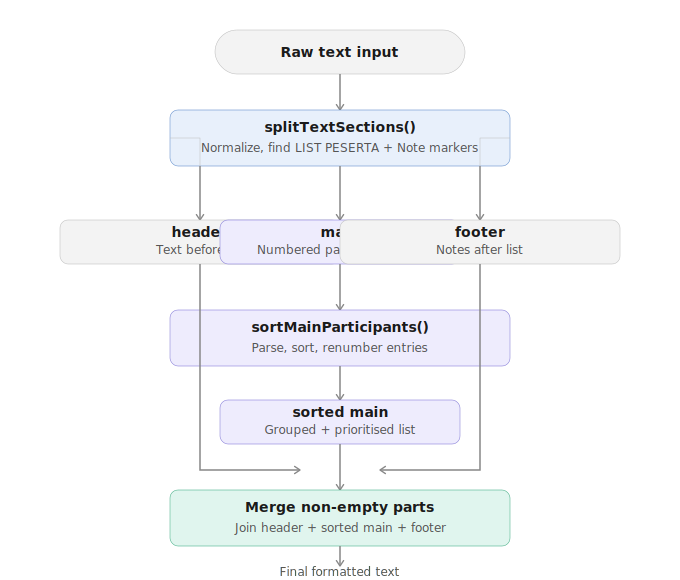
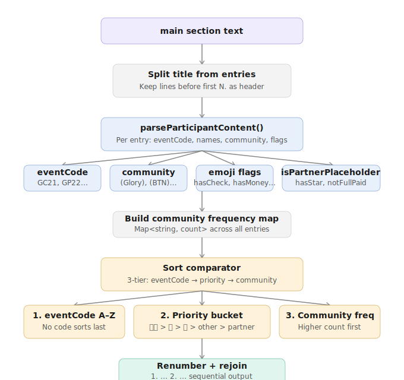

# Turnamen Open List Formatter

A small web utility for formatting and sorting open tournament participant lists from **Turnamen SKB**. Paste the raw list, click **Proses**, and get a cleanly sorted, copy-ready output.

---

## What it does

Raw participant lists from Turnamen SKB come in as numbered text with mixed ordering, emoji status markers, event codes, and community tags. This tool:

- **Parses** each participant entry (event code, names, community, emoji markers)
- **Groups** entries by event code (e.g. `GC21`, `GP22`, `GW11`) in alphabetical order
- **Sorts** within each group by payment/confirmation status:
  1. ✅💰 (confirmed + paid, partial payment first)
  2. ✅ (confirmed)
  3. 🎥 (video submitted)
  4. Others
  5. Partner placeholders
  6. Starred/commented entries
- **Re-numbers** the list sequentially after sorting
- Preserves the original header (`*LIST PESERTA*`) and any footer notes

---

## Entry format

Each participant line is expected to follow this pattern:

````
N. ```CODE``` Left Name (Cat) / Right Name (Cat) (Community)✅💰
````

| Part       | Example              | Notes                                    |
| ---------- | -------------------- | ---------------------------------------- |
| Number     | `1.`                 | Re-assigned after sorting                |
| Event code | ` ```GP22``` `       | Two uppercase letters + two digits       |
| Names      | `Aji (A) / Nuha (C)` | Left player / right player with category |
| Community  | `(Glory)`            | Optional, used for grouping context      |
| Markers    | `✅💰🎥💯`           | Used to determine sort priority          |

---

## Tech stack

- **React** + **TypeScript**
- **Vite**
- **Tailwind CSS**

---

## Getting started

```bash
# Install dependencies
npm install

# Start dev server
npm run dev

# Build for production
npm run build
```

---

## Project structure

```
src/
├── App.tsx              # Main UI
├── utils/
│   ├── string.ts        # Core parsing, sorting, and formatting logic
│   └── browser.ts       # Browser detection utilities (e.g. Safari check)
└── App.css
docs/
├── pipeline-overview.svg   # High-level parsing pipeline diagram
└── sort-logic-detail.svg   # sortMainParticipants internal flow diagram
```

---

## Core utilities (`utils/string.ts`)

| Function                     | Description                                                             |
| ---------------------------- | ----------------------------------------------------------------------- |
| `splitTextSections(text)`    | Splits raw input into `header`, `main` (participant list), and `footer` |
| `sortMainParticipants(main)` | Parses and sorts numbered entries within the main section               |
| `processAndSortText(text)`   | High-level helper: split → sort → merge back into final output          |
| `copyToClipboard(text)`      | Copies text with modern Clipboard API + legacy `execCommand` fallback   |
| `pasteFromClipboard()`       | Reads clipboard with modern API (hidden on Safari)                      |

---

## Flow diagrams

### Pipeline overview

`processAndSortText` orchestrates three steps: split the raw text into sections, sort the main participant list, then merge everything back.



### Sort logic detail

Inside `sortMainParticipants`, each numbered line is parsed by `parseParticipantContent`, a community frequency map is built, then entries are sorted by a three-tier comparator: **event code → priority bucket → community frequency**.


